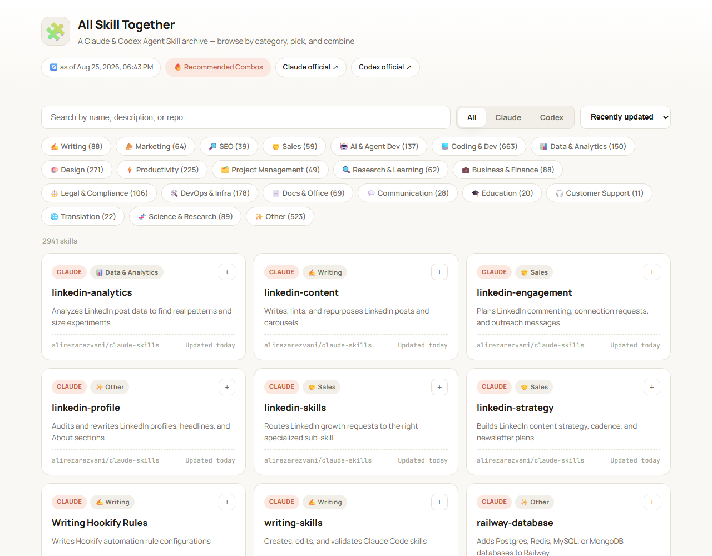

# All Skill Together 🧩

**A live, browsable directory of Claude and Codex Agent Skills — organized by category, updated every day, and combinable into ready-to-use bundles.**

[](https://skymined.github.io/awesome-claude-codex-skills/)
[](https://github.com/skymined/awesome-claude-codex-skills/stargazers)
[](https://github.com/skymined/awesome-claude-codex-skills/actions/workflows/update-skills.yml)
[](LICENSE)

### 👉 [**Open the site**](https://skymined.github.io/awesome-claude-codex-skills/) · [Browse recommended combos](https://skymined.github.io/awesome-claude-codex-skills/combos.html)



<!-- STATS:START -->
**3,296 skills** (2,548 Claude · 748 Codex) from **40 source repos**, rescanned automatically every day. Last synced: 2026-08-26.
<!-- STATS:END -->

If you find this useful, **a star helps other people find it** — this is a small side project, not a company, so word of mouth (and the GitHub star graph) is basically the whole distribution strategy.

## Browse by category

<!-- CATEGORY_TABLE:START -->
| Category | Skills | |
| --- | ---: | --- |
| 💻 Coding & Dev | 685 | [Browse →](https://skymined.github.io/awesome-claude-codex-skills/?category=coding) |
| ✨ Other | 569 | [Browse →](https://skymined.github.io/awesome-claude-codex-skills/?category=other) |
| 🎨 Design | 280 | [Browse →](https://skymined.github.io/awesome-claude-codex-skills/?category=design) |
| ⚡ Productivity | 231 | [Browse →](https://skymined.github.io/awesome-claude-codex-skills/?category=productivity) |
| 🛠️ DevOps & Infra | 179 | [Browse →](https://skymined.github.io/awesome-claude-codex-skills/?category=devops) |
| 📈 Stocks & Trading | 177 | [Browse →](https://skymined.github.io/awesome-claude-codex-skills/?category=stocks) |
| 📊 Data & Analytics | 156 | [Browse →](https://skymined.github.io/awesome-claude-codex-skills/?category=data) |
| 🤖 AI & Agent Dev | 146 | [Browse →](https://skymined.github.io/awesome-claude-codex-skills/?category=ai-agents) |
| 💼 Business & Finance | 125 | [Browse →](https://skymined.github.io/awesome-claude-codex-skills/?category=business) |
| ⚖️ Legal & Compliance | 110 | [Browse →](https://skymined.github.io/awesome-claude-codex-skills/?category=legal) |
| 🧬 Science & Research | 89 | [Browse →](https://skymined.github.io/awesome-claude-codex-skills/?category=science) |
| ✍️ Writing | 88 | [Browse →](https://skymined.github.io/awesome-claude-codex-skills/?category=writing) |
| 📄 Docs & Office | 88 | [Browse →](https://skymined.github.io/awesome-claude-codex-skills/?category=docs) |
| 📣 Marketing | 71 | [Browse →](https://skymined.github.io/awesome-claude-codex-skills/?category=marketing) |
| 🤝 Sales | 66 | [Browse →](https://skymined.github.io/awesome-claude-codex-skills/?category=sales) |
| 🔍 Research & Learning | 62 | [Browse →](https://skymined.github.io/awesome-claude-codex-skills/?category=research) |
| 🗂️ Project Management | 54 | [Browse →](https://skymined.github.io/awesome-claude-codex-skills/?category=pm) |
| 🔎 SEO | 39 | [Browse →](https://skymined.github.io/awesome-claude-codex-skills/?category=seo) |
| 💬 Communication | 28 | [Browse →](https://skymined.github.io/awesome-claude-codex-skills/?category=communication) |
| 🌐 Translation | 22 | [Browse →](https://skymined.github.io/awesome-claude-codex-skills/?category=translation) |
| 🎓 Education | 20 | [Browse →](https://skymined.github.io/awesome-claude-codex-skills/?category=education) |
| 🎧 Customer Support | 11 | [Browse →](https://skymined.github.io/awesome-claude-codex-skills/?category=support) |
<!-- CATEGORY_TABLE:END -->

## What makes this different from just another list

- **It's a real, working site, not a markdown list.** Every card fetches the actual `SKILL.md` straight from GitHub raw content and renders it in place — you're always looking at the current upstream file, never a stale copy.
- **Recommended combos are sourced, not invented.** The [combos page](https://skymined.github.io/awesome-claude-codex-skills/combos.html) only includes skill bundles traceable to something real: an official plugin manifest, a repo's own README, or a specific community post — each card links to where it came from.
- **You can build your own bundle.** Pick skills with the `+` button, then copy or download them merged into one file from the combo tray.
- **It updates itself.** GitHub Actions rescans every source repo daily and commits whatever changed — new skills, updated descriptions, refreshed dates — with no manual step.

## How it works

```
data/sources.json     → GitHub repos to scan (Claude / Codex)
data/categories.json  → category definitions + keyword-based auto-classification + manual overrides
data/summaries.json   → curated one-line card summaries, keyed by skill id
data/combos.json      → curated "recommended combo" bundles shown on combos.html
scripts/fetch-skills.mjs   → scans the repos, parses SKILL.md files, writes data/skills.json
scripts/recategorize.mjs   → re-applies category/summary rules to existing data without hitting GitHub again
scripts/update-readme.mjs  → regenerates the stats + category table above from data/skills.json
index.html / combos.html / assets/*.js,css → static frontend (no framework, runs straight in the browser)
.github/workflows/update-skills.yml → daily rescan + auto-commit on change
```

## Adding a new skill source

Add an entry to the `repos` array in `data/sources.json`.

```json
{
  "repo": "owner/repo",
  "branch": "main",
  "tool": "claude",
  "type": "collection",
  "match": ["SKILL.md"]
}
```

- `type: "collection"` — walks the whole repo and registers every file whose name is in `match` as a skill (for monorepos).
- `type: "single"` — for a repo that holds exactly one skill. Set `"path"` to the exact file, and optionally `"category"` to force its classification.

If the automatic categorization gets something wrong, add an override to `data/categories.json` under `overrides`, keyed as `"owner/repo#path/to/SKILL.md": "category-id"`.

Want to propose a combo for `combos.html`? It needs a real, checkable source (see `data/combos.json`'s own `_comment` field for the rules) — no invented pairings.

Once a PR merges, changes are picked up automatically at the next schedule (daily, 03:17 UTC) or via a manual `workflow_dispatch` run.

## Local development

```bash
# Re-scan sources (optional — a GITHUB_TOKEN raises the API rate limit)
GITHUB_TOKEN=$(gh auth token) node scripts/fetch-skills.mjs

# After editing categories.json/summaries.json only, skip the network round-trip:
node scripts/recategorize.mjs

# Refresh this README's stats/category table from the current data:
node scripts/update-readme.mjs

# Preview with a static server (fetch() is blocked on file://, so a server is required)
npx serve .
# or: python -m http.server 8080
```

## Deployment

Point GitHub Pages at the `main` branch, `/ (root)` in the repo settings — no build step needed. A `.nojekyll` file is included so the static files are served as-is, without Jekyll processing.

## License

Code in this repo is [MIT licensed](LICENSE). The skills indexed here remain the property of their original authors under their own repos' licenses — this site links to and fetches their content live, it doesn't redistribute it.
